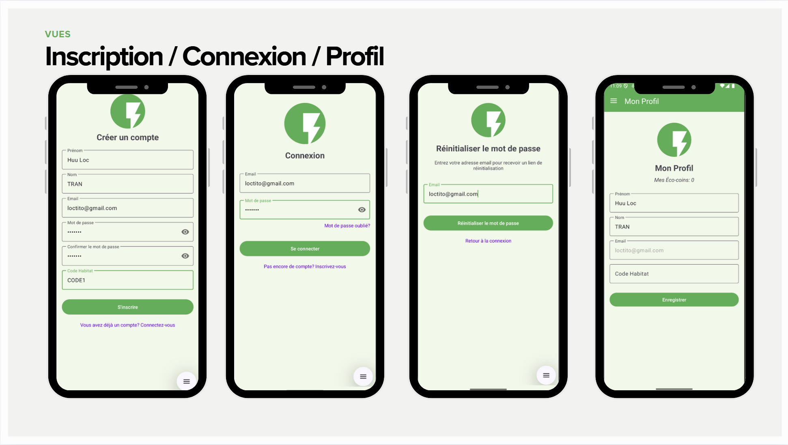
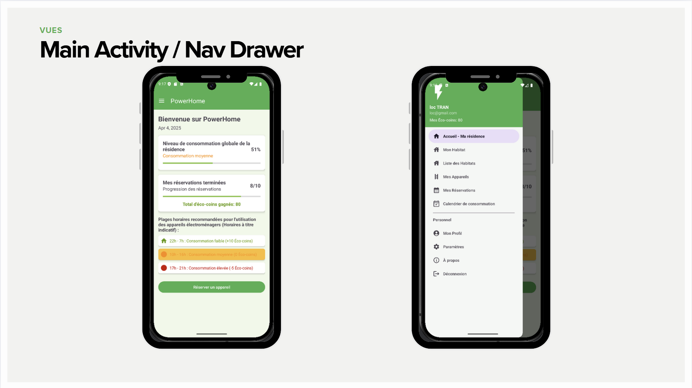
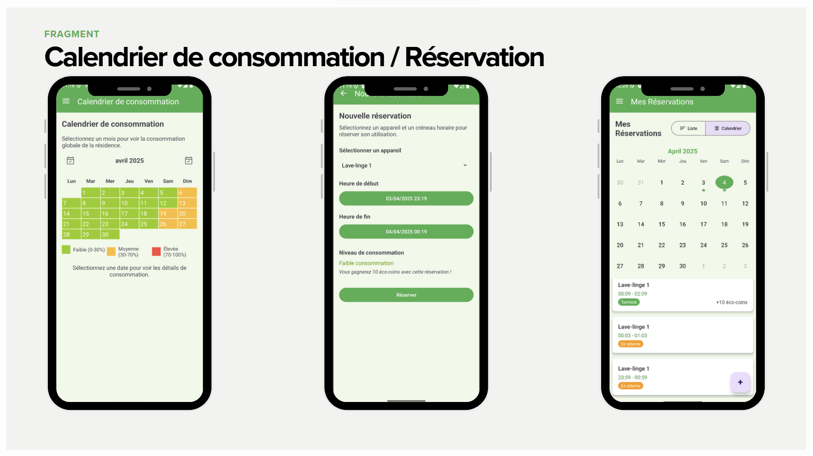
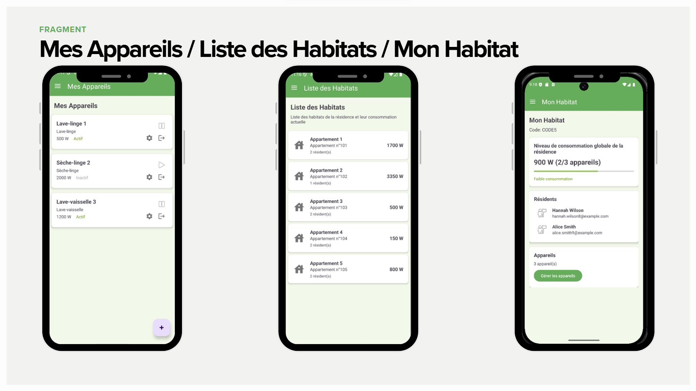
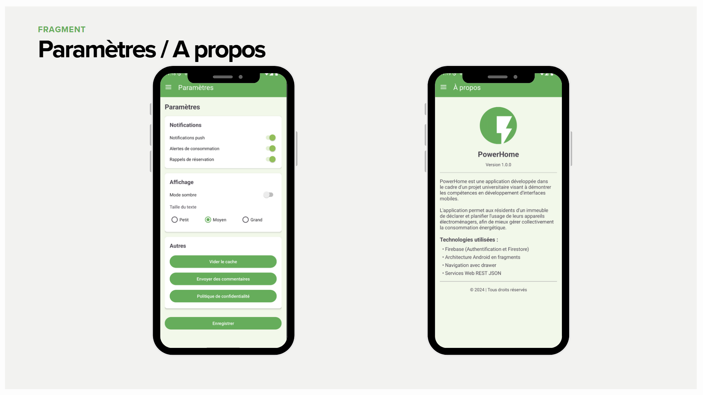

# PowerHome

PowerHome est une application Android de gestion intelligente d'habitat collectif. Elle permet aux résidents de suivre leur consommation électrique, de réserver des appareils partagés, de gérer leur profil et d'accéder à diverses fonctionnalités communautaires.

## Fonctionnalités principales
- **Tableau de bord** : Vue d'ensemble de la résidence et de la consommation électrique.
- **Gestion des habitats** : Liste des appartements, résidents et appareils associés.
- **Réservation d'appareils** : Réservez des équipements partagés via un calendrier interactif.
- **Suivi de la consommation** : Visualisez l'historique et les statistiques de consommation.
- **Profil utilisateur** : Gérez vos informations personnelles et vos préférences.
- **Paramètres** : Notifications, mode sombre, taille du texte, etc.
- **Authentification sécurisée** : Inscription, connexion, réinitialisation du mot de passe via Firebase Auth.

## Aperçu de l'application

### Inscription, connexion et profil utilisateur


### Accueil et menu de navigation


### Calendrier de consommation et réservation


### Mes appareils, liste des habitats et mon habitat


### Paramètres et À propos


---

## Installation et lancement de l'application Android

### Prérequis
- Android Studio (Flamingo ou plus récent recommandé)
- JDK 11 ou supérieur
- Un appareil ou émulateur Android
- Un projet Firebase (pour l'authentification et la base de données)

### Étapes
1. **Clonez le dépôt**
   ```bash
   git clone https://github.com/votre-utilisateur/PowerHome.git
   cd PowerHome
   ```
2. **Ouvrez le projet dans Android Studio**
3. **Ajoutez votre fichier `google-services.json`**
   - Téléchargez-le depuis la [console Firebase](https://console.firebase.google.com/)
   - Placez-le dans `app/google-services.json`
4. **Synchronisez et lancez le projet**
   - Cliquez sur "Sync Project with Gradle Files"
   - Lancez l'application sur un appareil ou un émulateur

---

# Outil d'export Firestore (Node.js)

Outil d'exportation de la base de données Firestore de l'application PowerHome en format JSON.

## Prérequis
- Node.js 14 ou supérieur
- npm ou yarn
- Clé de service Firebase pour votre projet

## Installation
1. Clonez ou téléchargez ce répertoire
2. Installez les dépendances :
   ```bash
   npm install
   # ou
   yarn install
   ```

## Configuration
1. Obtenez une clé de service Firebase :
   - Allez sur la [Console Firebase](https://console.firebase.google.com/)
   - Sélectionnez votre projet
   - Allez dans "Paramètres du projet" > "Comptes de service"
   - Cliquez sur "Générer une nouvelle clé privée"
   - Enregistrez le fichier JSON généré
2. Placez ce fichier à la racine du projet et renommez-le `serviceAccountKey.json`

## Utilisation
Pour exporter toutes les collections :
```bash
npm run export
# ou
yarn export
```

Vous pouvez également spécifier un emplacement personnalisé pour votre clé de service :
```bash
SERVICE_ACCOUNT_PATH=/chemin/vers/votre/cle.json npm run export
```
Ou personnaliser le dossier d'exportation :
```bash
EXPORT_DIR=/chemin/vers/dossier/export npm run export
```

## Résultats
Le script va :
1. Créer un dossier `firestore-export` (ou le dossier spécifié dans `EXPORT_DIR`)
2. Exporter chaque collection dans un fichier JSON séparé avec horodatage
3. Créer un fichier JSON combiné contenant toutes les collections

Les champs spéciaux de Firestore (références, timestamps, geopoints) sont convertis en objets JSON avec un champ `_type` pour indiquer leur type d'origine.

## Remarques
- Les sous-collections sont exportées comme des collections de premier niveau
- Les types de données spéciaux sont convertis en structures JSON standard avec des annotations de type
- L'export est complet et inclut tous les documents et champs

---

## Sécurité & bonnes pratiques
- **Ne partagez jamais vos fichiers de clé API** (`app/google-services.json`, `serviceAccountKey.json`). Ils sont ignorés par git grâce au `.gitignore`.
- Ne stockez pas de secrets ou de mots de passe en clair dans le code source.
- Utilisez les variables d'environnement pour les scripts Node.js si besoin.

---


## Licence
Ce projet est sous licence MIT. Voir le fichier [LICENSE](./LICENSE) pour plus d'informations. 